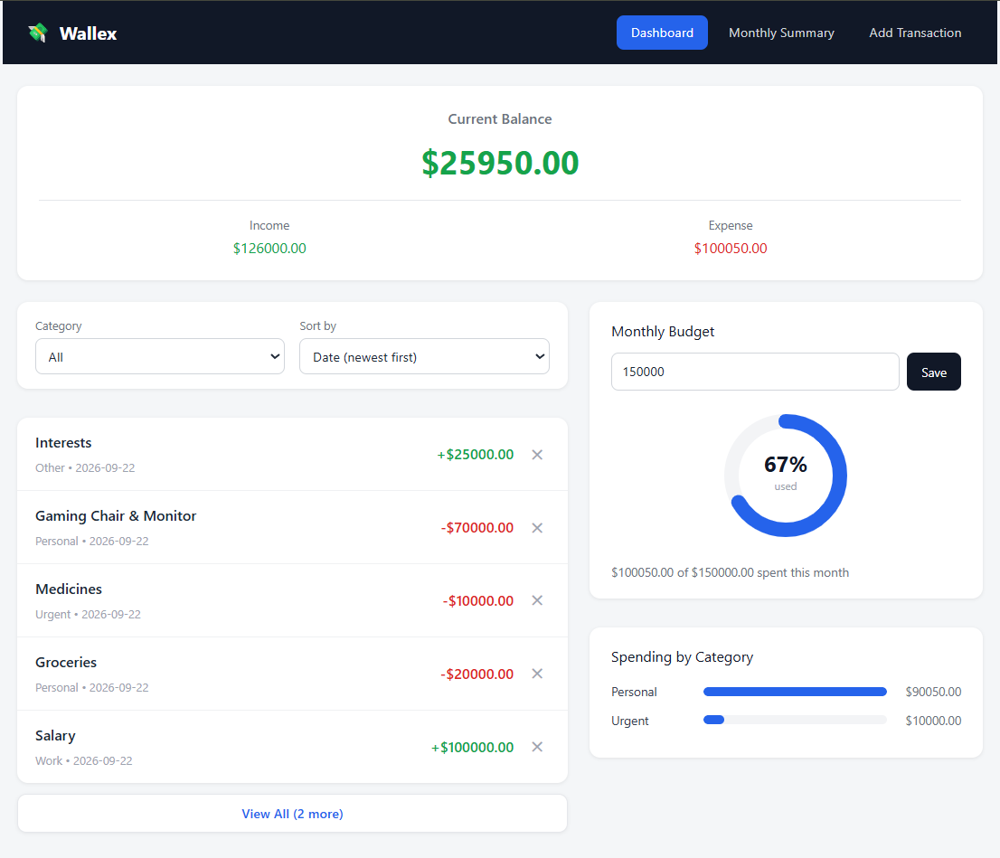
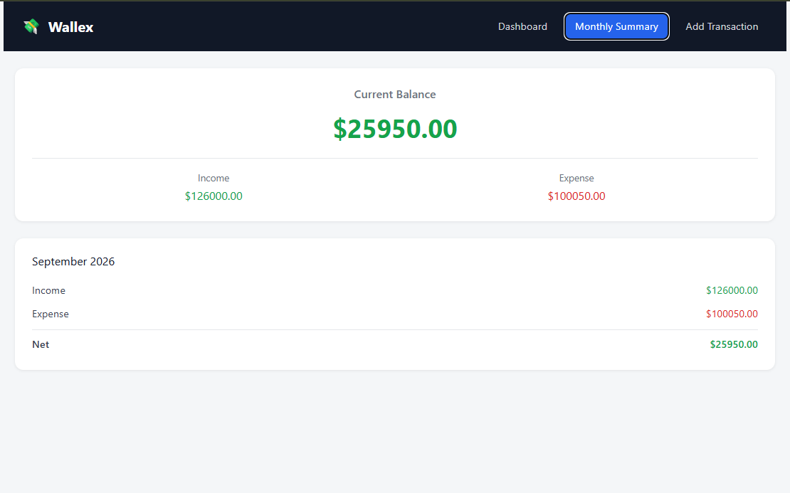
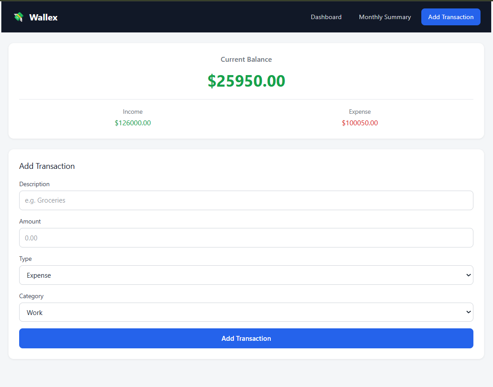

# Wallex — Personal Expense Tracker

Wallex is a responsive React application for tracking personal income and expenses. Users can log transactions, monitor a running balance, set a monthly budget, and visualize their spending habits — all without needing a backend, since data is saved locally in the browser.

## Features

- Add transactions with description, amount, type (income/expense), and category
- View a running balance (income − expenses) updated in real time
- List all transactions with category and date, with a "View All / Show Less" toggle after the first 5
- Delete individual transactions, with a custom confirmation dialog to prevent accidental deletion
- Filter transactions by category and sort by date or amount
- Set a monthly budget with a donut-chart progress indicator and an overspend warning banner
- Visualize spending by category with a bar chart
- View a monthly summary of income, expenses, and net total
- Toggle between light and dark themes, with the choice remembered across visits
- Data persists across page refreshes using `localStorage`
- Two-column dashboard layout on desktop that adapts to a single stacked column (with budget/chart shown above transactions) on mobile
- In-app navigation between Dashboard, Monthly Summary, and Add Transaction views

## Technologies Used

- [React](https://react.dev/) (functional components + hooks: `useState`, `useEffect`)
- [Vite](https://vitejs.dev/) — build tool and dev server
- Plain CSS (no external UI library), using CSS Grid for the responsive layout and CSS custom properties (variables) for light/dark theming
- Inline SVG for the budget donut chart (no charting library)
- Browser `localStorage` API for persistence

## Setup Instructions

1. Clone the repository:

git clone https://github.com/ashad0806/Expence_Tracker.git
cd Expence_Tracker

2. Install dependencies:

npm install

3. Run the development server:

npm run dev

4. Open the URL shown in your terminal (usually `http://localhost:5173`).

## Screenshots

### Dashboard

### Monthly Summary

### Add Transaction

## Known Limitations

- Data is stored per-browser via `localStorage`, not synced across devices or accounts.
- No user authentication — all transactions are local to the current browser.
- The monthly budget applies to the current calendar month only; there's no historical budget-vs-actual view for past months.

## License

This project is licensed under the MIT License — see the [LICENSE](./LICENSE) file for details.